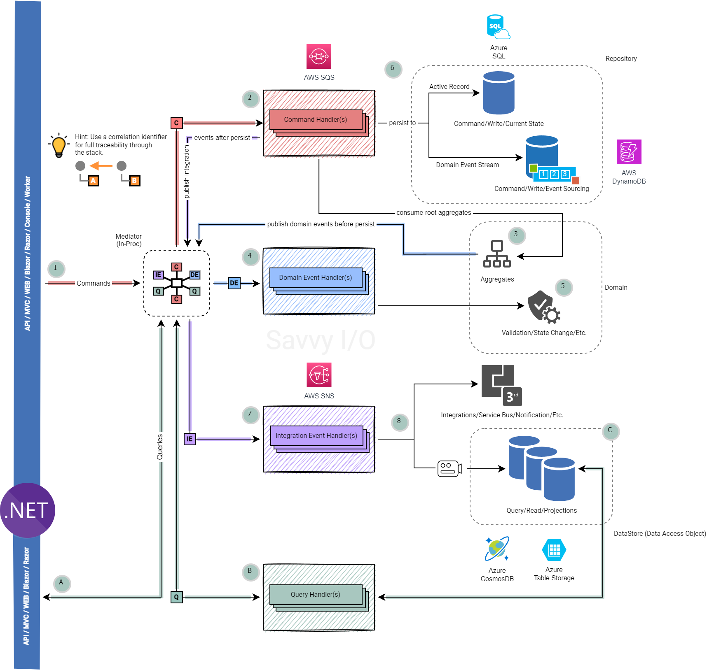

# Savvy I/O

An open-source project (MIT license) that provides a SOLID and clean .NET class library for writing DDD, CQRS and Event Sourcing applications for .NET 8 (LTS) and .NET 6 (LTS).

It is, by heart, free, flexible and built to extend and boost your agile codebelt.

## Motivation

Savvy I/O is designed to be intuitive and follows many of the same patterns and practices that was applied to [Cuemon for .NET](https://github.com/gimlichael/Cuemon).

The grand idea and motivation was to remove the complexity normally associated with DDD, CQRS and Event Sourcing.

## State of the Union

Support for .NET 7 has been deprecated as these are out of [support](https://endoflife.date/dotnet).

> [!IMPORTANT]
> Version 2.2.0 of Savvy I/O will be the last version to support .NET 7.

Full documentation (generated by [DocFx](https://github.com/dotnet/docfx)) located here: https://docs.savvyio.net/

All CI and CD integrations have been migrated away from [Microsoft Azure DevOps](https://azure.microsoft.com/en-us/services/devops/) and now embraces GitHub Actions based on the [Codebelt](https://github.com/codebeltnet) umbrella.

All code quality analysis are done by [SonarCloud](https://sonarcloud.io/) and [CodeCov.io](https://codecov.io/).

    

## Branching Strategy

We have finally moved away from the somewhat dated `git flow` branching strategy, and adapted `trunk` based branching that is more aligned with todays DevSecOps practices.

That means, going forward, only one branch will be maintained; `main`. The previous branches, `development` and `release` is for reference only.

> [!NOTE]
> `main` branch will be a clean slate starting from v3.0.0, meaning no previous commits will be preserved. Previous bad practices is a result of this, and going forward we will use Squash or Rebase before committing new code.

## Tag Versioning

We will continue using semantic versioning and account for [pre-release](https://docs.microsoft.com/en-us/nuget/concepts/package-versioning#pre-release-versions) versions when tagging in git.

### Code Quality Monitoring

   

     

# Contributing to Savvy I/O

A big welcome and thank you for considering contributing to Savvy I/O open source project!

Please read more about [contributing to Savvy I/O](.github/CONTRIBUTING.md).

# Code of Conduct

Project maintainers pledge to foster an open and welcoming environment, and ask contributors to do the same.

For more information see our [code of conduct](.github/CODE_OF_CONDUCT.md).

## Links to NuGet packages

This is a list of all NuGet packages from Savvy I/O that is publicly available on [NuGet.org](https://www.nuget.org/packages?q=savvyio); the packages here are listed alphabetically and are available in preview-, rc- and production-ready versions.

### 📦 Standalone Packages

Provides a focused API for building various types of modern .NET applications suitable for DDD, CQRS and Event Sourcing.

|Package|vNext|Stable|Downloads|
|:--|:-:|:-:|:-:|
| [Savvyio.Commands](https://www.nuget.org/packages/Savvyio.Commands/) |  |  |  |
| [Savvyio.Commands.Messaging](https://www.nuget.org/packages/Savvyio.Commands.Messaging/) |  |  |  |
| [Savvio.Core](https://www.nuget.org/packages/Savvyio.Core/) |  |  |  |
| [Savvyio.Domain](https://www.nuget.org/packages/Savvyio.Domain/) |  |  |  |
| [Savvyio.Domain.EventSourcing](https://www.nuget.org/packages/Savvyio.Domain.EventSourcing/) |  |  |  |
| [Savvyio.EventDriven](https://www.nuget.org/packages/Savvyio.EventDriven/) |  |  |  |
| [Savvyio.EventDriven.Messaging](https://www.nuget.org/packages/Savvyio.EventDriven.Messaging/) |  |  |  |
| [Savvyio.Extensions.Dapper](https://www.nuget.org/packages/Savvyio.Extensions.Dapper/) |  |  |  |
| [Savvyio.Extensions.DapperExtensions](https://www.nuget.org/packages/Savvyio.Extensions.DapperExtensions/) |  |  |  |
| [Savvyio.Extensions.DependencyInjection](https://www.nuget.org/packages/Savvyio.Extensions.DependencyInjection/) |  |  |  |
| [Savvyio.Extensions.DependencyInjection.Dapper](https://www.nuget.org/packages/Savvyio.Extensions.DependencyInjection.Dapper/) |  |  |  |
| [Savvyio.Extensions.DependencyInjection.DapperExtensions](https://www.nuget.org/packages/Savvyio.Extensions.DependencyInjection.DapperExtensions/) |  |  |  |
| [Savvyio.Extensions.DependencyInjection.Domain](https://www.nuget.org/packages/Savvyio.Extensions.DependencyInjection.Domain/) |  |  |  |
| [Savvyio.Extensions.DependencyInjection.EFCore](https://www.nuget.org/packages/Savvyio.Extensions.DependencyInjection.EFCore/) |  |  |  |
| [Savvyio.Extensions.DependencyInjection.EFCore.Domain](https://www.nuget.org/packages/Savvyio.Extensions.DependencyInjection.EFCore.Domain/) |  |  |  |
| [Savvyio.Extensions.DependencyInjection.EFCore.Domain.EventSourcing](https://www.nuget.org/packages/Savvyio.Extensions.DependencyInjection.EFCore.Domain.EventSourcing/) |  |  |  |
| [Savvyio.Extensions.DependencyInjection.QueueStorage](https://www.nuget.org/packages/Savvyio.Extensions.DependencyInjection.QueueStorage/) |  |  |  |
| [Savvyio.Extensions.DependencyInjection.SimpleQueueService](https://www.nuget.org/packages/Savvyio.Extensions.DependencyInjection.SimpleQueueService/) |  |  |  |
| [Savvyio.Extensions.Dispatchers](https://www.nuget.org/packages/Savvyio.Extensions.Dispatchers/) |  |  |  |
| [Savvyio.Extensions.EFCore](https://www.nuget.org/packages/Savvyio.Extensions.EFCore/) |  |  |  |
| [Savvyio.Extensions.EFCore.Domain](https://www.nuget.org/packages/Savvyio.Extensions.EFCore.Domain/) |  |  |  |
| [Savvyio.Extensions.EFCore.Domain.EventSourcing](https://www.nuget.org/packages/Savvyio.Extensions.EFCore.Domain.EventSourcing/) |  |  |  |
| [Savvyio.Extensions.Newtonsoft.Json](https://www.nuget.org/packages/Savvyio.Extensions.Newtonsoft.Json/) |  |  |  |
| [Savvyio.Extensions.QueueStorage](https://www.nuget.org/packages/Savvyio.Extensions.QueueStorage/) |  |  |  |
| [Savvyio.Extensions.SimpleQueueService](https://www.nuget.org/packages/Savvyio.Extensions.SimpleQueueService/) |  |  |  |
| [Savvyio.Extensions.Text.Json](https://www.nuget.org/packages/Savvyio.Extensions.Text.Json/) |  |  |  |
| [Savvyio.Messaging](https://www.nuget.org/packages/Savvyio.Messaging/) |  |  |  |
| [Savvyio.Queries](https://www.nuget.org/packages/Savvyio.Queries/) |  |  |  |

### 🏭 Productivity Packages

Provides a convenient set of default API additions for building complete DDD, CQRS and Event Sourcing enabled .NET applications using Microsoft Dependency Injection, Microsoft Entity Framework Core, Dapper and AWS SNS/SQS.

|Package|vNext|Stable|Downloads|
|:--|:-:|:-:|:-:|
| [Savvyio.App](https://www.nuget.org/packages/Savvyio.App/) |  |  |  |
